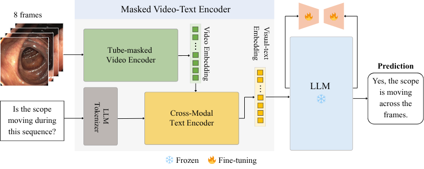
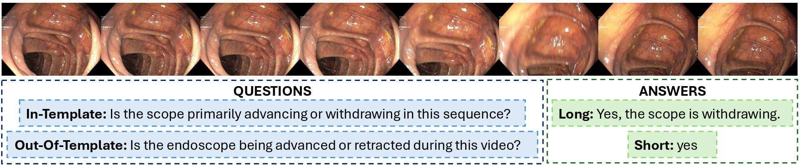

<div align="center">

<h2>SurgViVQA: Temporally-Grounded Video Question Answering for Surgical Scene Understanding</h2>

<p>
Mauro Orazio Drago*, Luca Carlini*, Dennis Pierantozzi, <br>
Pelinsu Celebi Balyemez, Chiara Lena, Cesare Hassan, <br>
Danail Stoyanov, Sophia Bano, Elena De Momi, <br> 
and Mobarak I. Hoque*
</p>

---

<table align="center">
  <tr>
    <td><b><a href="https://arxiv.org/abs/2511.03325">arXiv</a></b></td>
    <!-- <td><b><a href="https://link.springer.com/">Paper</a></b></td> -->
  </tr>
</table>

</div>

## Overview

This repository implements **SurgViVQA**, a novel approach for **Surgical Video Question Answering (VideoVQA)**.  

It enables AI models to answer questions about surgical videos by reasoning over **temporally coherent events**, such as instrument movements and anatomical changes, rather than isolated frames. The repository also provides the **REAL-Colon-VQA dataset**, a benchmark with temporally annotated colonoscopic video clips for evaluating video-based VQA models. 

## Model Architecture: SurgViVQA

The SurgViVQA framework processes surgical video clips and corresponding questions to generate temporally-aware, context-grounded answers.

<p align="center">
  
</p>

*Figure: SurgViVQA model architecture illustrating the Masked Video–Text Encoder and LoRA-adapted LLM.*

**Key components:**

- **Masked Video–Text Encoder:**  
  Captures temporal dynamics in surgical procedures. Consists of a video encoder and a text encoder with built-in cross-attention. Integrates tube-masked video embeddings with question representations, allowing each question token to attend to the full temporal sequence of visual features. Produces unified embeddings that capture motion, tool interactions, and anatomical dynamics for downstream VQA tasks.

- **LLM with LoRA Adaptation:**  
  The fused video–text embeddings are passed into a frozen causal LLM (e.g., GPT-2, Qwen3) enhanced with **LoRA (Low-Rank Adaptation)** for efficient fine-tuning. The decoder, built from stacked transformer blocks, uses multi-head self-attention, layer normalization, and feed-forward layers to generate open-ended, free-form answers autoregressively, grounded in the video–text context.

The framework integrates temporal context from video frames to enhance VQA performance, capturing the progression of surgical actions and tool usage over time.

## Dataset: REAL-Colon-VQA

REAL-Colon-VQA is a VideoVQA dataset derived from six colonoscopic procedures. It extends the original [REAL-Colon](https://plus.figshare.com/articles/media/REAL-colon_dataset/22202866) annotations with temporally aligned contextual and instrument-level metadata, enabling temporal and diagnostic reasoning.  

Key features:  
- **Video clips:** 8-frame clips with stride 4  
- **Q&A pairs:** Each clip is paired with both long-form and short-form answers  
- **Reasoning domains:** 18 question categories grouped into 6 domains (Instruments, Sizing, Diagnosis, Positions, Operation Notes, Movement)  
- **Dataset size:** 5,200 QA instances for each answer type (long-form and short-form)  
- **Temporal reasoning:** Captures endoscope and lesion motion, lighting changes, occlusions  

> **Note:** The annotations are included in the repository under the folder `REAL-Colon-VQA_annotations`.
> Detailed field descriptions, question domains, and example entries can be found in the [annotation README](./REAL-Colon-VQA_annotations/README.md).

<p align="center">
  
</p>

*Figure: An 8-frame colonoscopic video clip with its corresponding question and answers (long and short forms).*


## Project Structure

```
.
├── assets
│   └── model.png                 # Model architecture illustration
├── dataloaders.py                # Data loading utilities
├── environment.yml               # Conda environment configuration
├── evaluation.py                 # Evaluation scripts and metrics for inference
├── keywords_generation
│   └── keywords_extraction.py    # Script to extract keywords from QA answers
├── models
│   └── model.py                  # SurgViVQA definition
├── README.md                     # Main project README
├── REAL-Colon-VQA_annotations    # Dataset annotations
│   ├── in_template.jsonl         # In-template annotations
│   ├── out_template.jsonl        # Out-template annotations
│   └── README.md                 # Annotation details and example
├── requirements.txt              # Python package requirements
├── train.py                      # Training script
└── utils
    ├── inference.py              # Inference utilities
    ├── metrics.py                # Metric computation functions
    └── trainer.py                # Training utilities (loops, logging, checkpoints)
````

## Installation

Create a conda environment:

```bash
conda env create -f environment.yml
conda activate SurgViVQAEnv
````

Or install directly from `requirements.txt`:

```bash
pip install -r requirements.txt
```

## Training

The `train.py` script uses the model in `models/model.py` and data loaded via `dataloaders.py`. It trains SurgViVQA to predict answers for video QA tasks, taking temporal context into account.

Example usage:

```bash
python -m train --dataset realcolon --epochs 60 --batch_size 16 --lr 0.0000002 --seq_length 64 --workers 8
```

> **Note:** When using the EndoVis18-VQA dataset ([in-template](https://drive.google.com/drive/folders/1hu_yK27Xz2_lvjjZ97-WF2MK_JO14MWI?usp=sharing), [out-template](https://drive.google.com/file/d/1NfVaNWvQPpKx9Ohr0WyCkKTHYk_cYMPA/view)), please note that it does **not** include a keyword section. Keywords need to be generated using the `keywords_generation/keywords_extraction.py` script before training if EndoVis18-VQA dataset is used.

## Evaluation

To comprehensively evaluate SurgViVQA, we use a set of automatic metrics capturing both **linguistic accuracy** and **semantic fidelity**:

- **BLEU-4:** Measures n-gram overlap between generated and reference answers, reflecting linguistic accuracy.  
- **ROUGE-L & METEOR:** Assess semantic coherence with human responses.  
- **Keyword Accuracy (K-ACC):** Especially important in the clinical context; evaluates whether the model correctly generates the relevant surgical or anatomical term, providing a direct measure of factual grounding and clinical relevance.

The evaluation is performed using the `evaluation.py` script, which computes these metrics on the chosen dataset. Example usage:

```bash
python -m evaluation --dataset realcolon --batch_size 16 --seq_length 64 --workers 8
```

## Pre-trained Weights

The pre-trained SurgViVQA model weights are available via [Google Drive](https://drive.google.com/drive/folders/10ksHypCl7lBSQjV70VGoQaR6GsS3498a?usp=sharing).


## Citation

If you use this code, please cite:

```
@misc{drago2025surgvivqa,
  title        = {SurgViVQA: Temporally-Grounded Video Question Answering for Surgical Scene Understanding},
  author       = {Mauro Orazio Drago and Luca Carlini and Pelinsu Celebi Balyemez and Dennis Pierantozzi and Chiara Lena and Cesare Hassan and Danail Stoyanov and Elena De Momi and Sophia Bano and Mobarak I. Hoque},
  year         = {2025},
  eprint       = {2511.03325},
  archivePrefix= {arXiv},
  primaryClass = {cs.CV},
  url          = {https://arxiv.org/abs/2511.03325},
  note         = {Under revision}
}

```